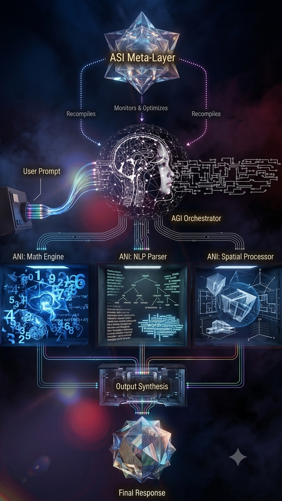

# A3-I3 Engine 🧠💻

  

### 💻 Core Programming Languages

### ⚙️ Core Systems

### 🏗️ Platform Support & Hardware Architecture

### ⚡ Low-Level Infrastructure & Performance

### 🛡️ Cybersecurity & Offensive Auditing

### 🛠️ DevOps & Build Tools

### 🧠 Artificial Intelligence & Quantum

### ☁️ Cloud Providers

## What Is This About?
Imagine a computer brain that has three different levels of smarts all working together as a super team! The A3-I3 Engine is a brand-new kind of computer program that mixes three types of Artificial Intelligence (AI) into one big system:
*   **Narrow AI (ANI):** The "Specialists." They are really good at doing one specific job (like doing math or reading words).
*   **General AI (AGI):** The "Manager." It is good at thinking, solving tricky problems, and deciding who should do what.
*   **Super AI (ASI):** The "Boss." The smartest layer that watches everything and makes the whole system better.

## What This Does?
This engine acts like a factory where different AI workers do what they are best at! 
*   When a problem comes in, the **General AI** manager breaks it into smaller pieces and hands those specific jobs to the **Narrow AI** workers.
*   Once the workers finish, the manager puts all their answers together into one great final answer.
*   While all of this is happening, the **Super AI** boss is constantly watching the system. It can actually rewrite its own code to make the engine run faster and smoother the next time!

## What Problems This Solves?
Usually, AI programs are only good at *one* thing at a time. If you give a regular AI a giant, super complicated project with lots of different moving parts, it gets stuck or confused. 

This engine solves that problem by sharing the workload. Because it has a manager AI that knows how to split up tasks, it can handle massive problems without crashing. It never gets overwhelmed because everyone has a specific job to do!

## Why This Is Cool?
It is super cool because **it can upgrade itself!** 

Instead of waiting for a human programmer to make it better, the A3-I3 Engine uses super-fast coding languages (like Rust and C++) to fix its own code while it is running. It also connects straight to powerful computer graphics cards (GPUs) so it can think at lightning speed, making it one of the fastest and smartest computer brains around!

## How To Install This?
To get this super brain running on your computer, you will need to use terminal commands and a tool called Docker (which helps run code in a safe little box).

1. First, download the project code to your computer.
2. Open your computer's terminal (command line).
3. Type `make build` and press enter. This tells the computer to put all the complicated pieces together.
4. Once it is built, type `make run` to turn the engine on! 

> **Note:** To run this at full speed, your computer needs a special NVIDIA graphics card!
