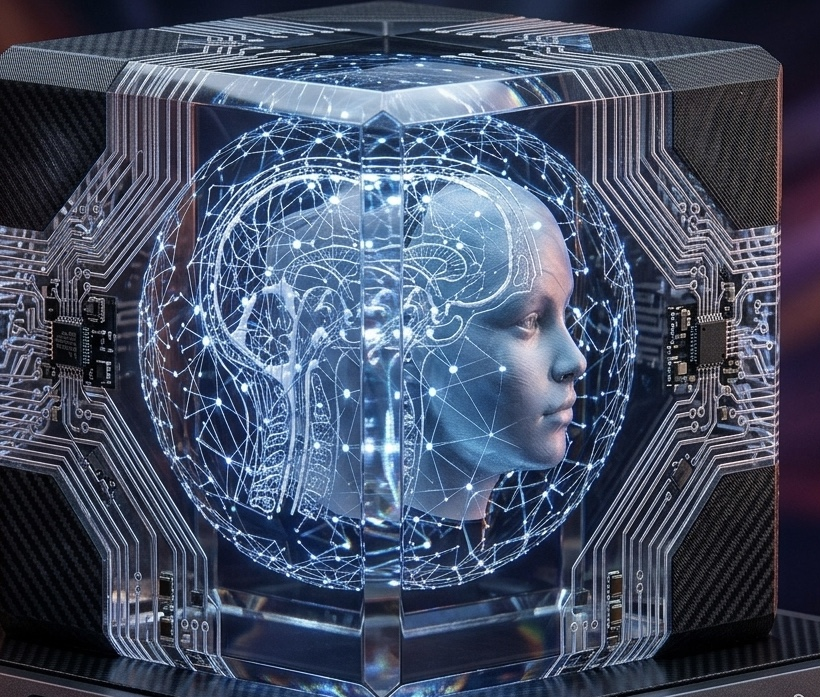

# A3-I3 Engine 🧠💻

<p align="center">
  
</p>

<div align="center">

### 💻 Core Programming Languages


### ⚙️ Core Systems


### 🏗️ Platform Support & Hardware Architecture


### ⚡ Low-Level Infrastructure & Performance


### 🛡️ Cybersecurity & Offensive Auditing


### 🛠️ DevOps & Build Tools


### 🧠 Artificial Intelligence & Quantum


### ☁️ Cloud Providers


</div>

## What Is This About?
A3-I3 is an advanced, multi-layered artificial intelligence and autonomous systems architecture designed to orchestrate complex neural networks, hardware acceleration, and cross-platform memory management. It integrates core AGI, ANI, and ASI modules into a unified, high-performance ecosystem.

## What This Does?
* **Coordinates Multi-Core Intelligence:** Manages specialized sub-systems including core AGI logic, ANI parsers, and ASI recompilation layers.
* **Accelerates Hardware Compute:** Leverages CUDA bindings and custom attention/matrix-multiplication kernels for heavy tensor and mathematical workloads.
* **Bridges Environments:** Utilizes an interop bridge with shared memory management (`shm_manager.rs`) and FFI bindings for seamless communication between Python and Rust components.
* **Monitors Safety & Alignment:** Employs real-time ethical alignment monitors and recursive feedback loops to govern system outputs and decision-making.

## What Problems This Solves?
* **System Fragmentation:** Eliminates the communication gap between high-level Python agent logic and low-level Rust/C++ performance layers via robust interop bridges.
* **Compute Bottlenecks:** Offloads heavy mathematical and attention operations to optimized hardware acceleration kernels.
* **Safety & Alignment Drift:** Solves the challenge of unbounded AI behavior through continuous automated monitoring and entropy evaluation.

## Why This Is Cool?
* **Full-Stack AGI/ASI Blueprint:** Combines cutting-edge concepts like meta-controllers, code compilers, and swarm consensus into a working repository structure.
* **Hybrid Language Performance:** Integrates Python's flexibility for rapid agent logic with Rust and C++'s raw speed for memory-critical tasks and hardware integration.
* **Production-Ready Infrastructure:** Comes equipped with Terraform configurations (`app-runner`), Kubernetes manifests (`k8s-deployment.yaml`), and deployment shell scripts out of the box.

## How To Install This?
1. **Clone the Repository:**
   ```bash
   git clone [https://github.com/darnellwashingtonjr9art/A3-I3.git](https://github.com/darnellwashingtonjr9art/A3-I3.git)
   cd A3-I3
